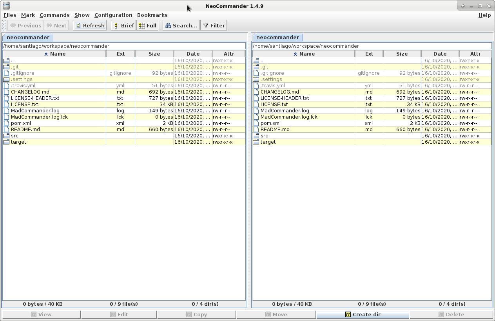

[](https://travis-ci.org/santiagolizardo/neocommander)

NeoCommander
============



**NeoCommander** is an *orthodox file manager* written in Java Swing. Tested on Windows, Mac and Linux.

### Requirements


  * Java SE 11
  * Graphical user interface environment

### How to build

```sh
mvn package
```

### How to run

```sh
java -jar target/NeoCommander-1.4.11-jar-with-dependencies.jar
```

or double click on the jar file using your default file manager.

