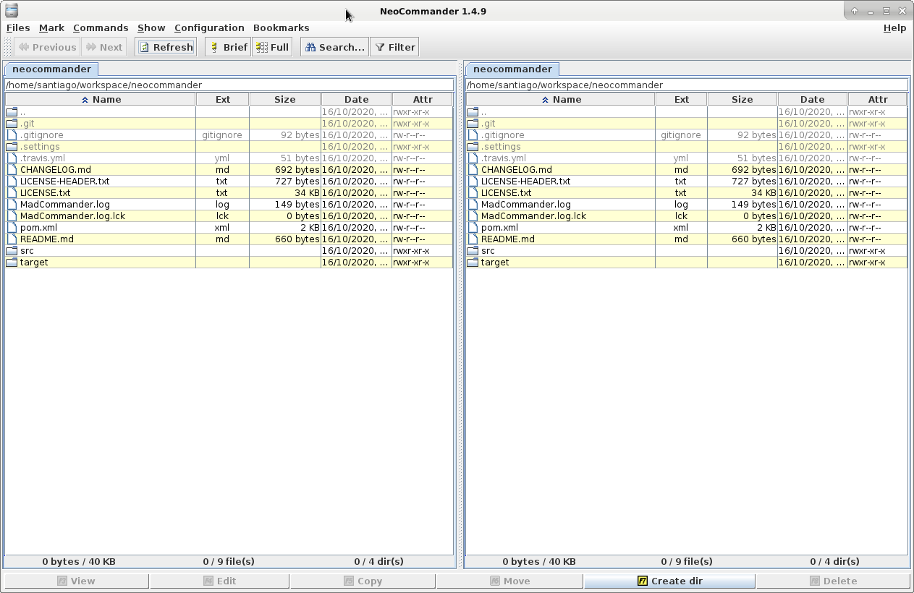

NeoCommander
============



**NeoCommander** is an *orthodox file manager* written in Java Swing. Tested on Windows, Mac and Linux.

### Requirements

  * Java 25
  * Graphical user interface environment

### How to build

```sh
mvn package
```

### How to run

```shell
java -jar target/NeoCommander-*-jar-with-dependencies.jar
```

or double click on the jar file using your default file manager.

